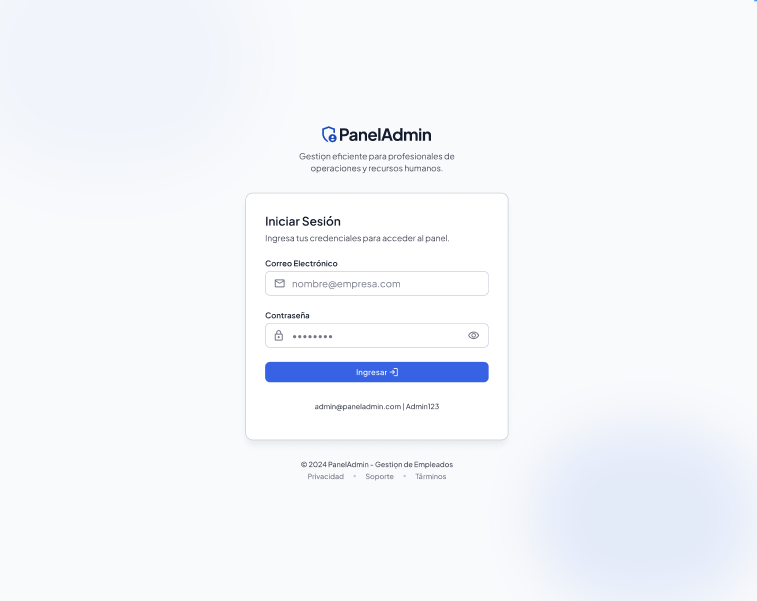
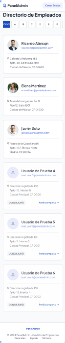
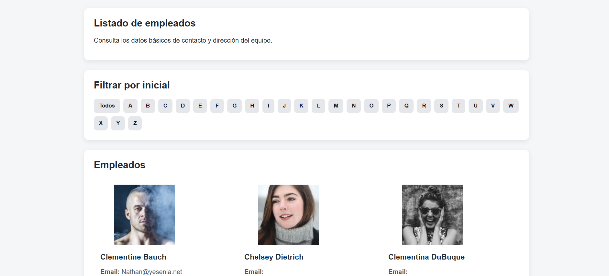
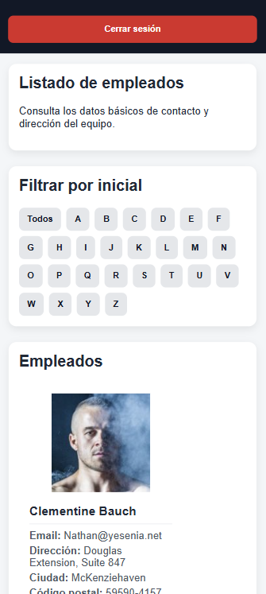
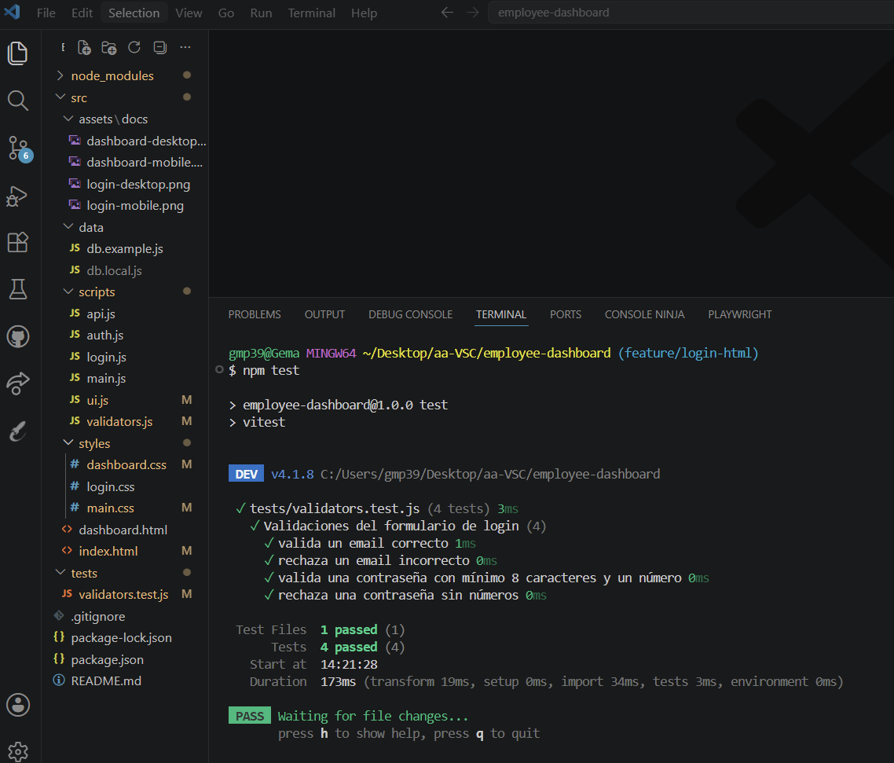
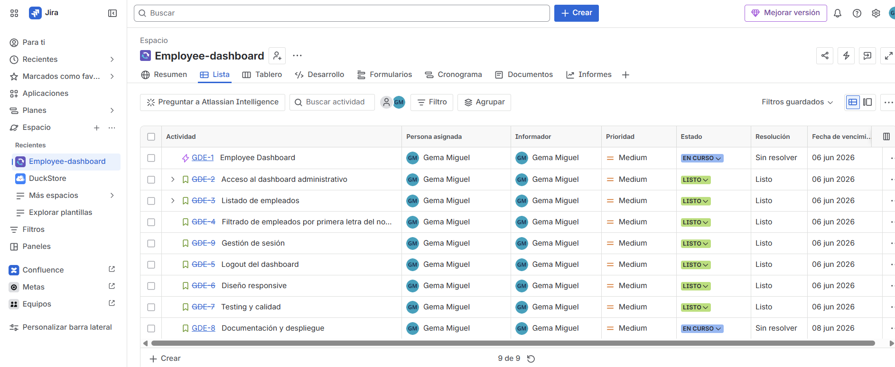

## Descripción del proyecto

Employee Dashboard es una aplicación web desarrollada con HTML, CSS y JavaScript Vanilla que permite a un usuario administrador acceder a un panel de gestión de empleados.

La aplicación consume datos desde una API externa, permite visualizar información básica de los empleados, filtrar el listado por la inicial del nombre y gestionar la sesión mediante localStorage.

Además, cuenta con diseño responsive para dispositivos móviles y de escritorio, así como pruebas unitarias desarrolladas con Vitest.

## Tecnologías utilizadas

- HTML5
- CSS3
- JavaScript (Vanilla)
- Fetch API
- LocalStorage
- Vitest
- Git
- GitHub
- Jira
- Figma / Stitch

## Prototipo

### Login Desktop



### Login Mobile


### Dashboard Desktop


### Dashboard Mobile



## Aplicación final

### Login Desktop


### Login Mobile


### Dashboard Desktop



### Dashboard Mobile



## Flujo de usuario

1. El usuario accede a la página de login.
2. Introduce sus credenciales.
3. Se validan email y contraseña.
4. Si son correctos, se almacena la sesión en localStorage.
5. El usuario accede al dashboard.
6. Se cargan los empleados desde la API.
7. Puede filtrar empleados por inicial.
8. Puede cerrar sesión mediante el botón Logout.

## Criterios de aceptación

- Acceso mediante email y contraseña.
- Validación de formato de email.
- Validación de contraseña con mínimo 8 caracteres y un número.
- Gestión de sesión mediante localStorage.
- Consumo de API externa.
- Visualización de empleados.
- Filtrado por inicial.
- Logout funcional.
- Diseño responsive.
- Testing unitario con Vitest.

## Estructura del proyecto

```text
├── assets/
│   └── docs/
├── data/
├── scripts/
│   ├── api.js
│   ├── auth.js
│   ├── login.js
│   ├── main.js
│   ├── ui.js
│   └── validators.js
├── styles/
│   ├── dashboard.css
│   ├── login.css
│   └── main.css
├── dashboard.html
└── index.html

tests/
└── validators.test.js
```

## Instalación y ejecución

### Clonar el repositorio

```bash
git clone https://github.com/gmp395/employee-dashboard.git
```

### Acceder a la carpeta del proyecto

```bash
cd employee-dashboard
```

### Instalar dependencias

```bash
npm install
```

### Ejecutar los tests

```bash
npm test
```

### Ejecutar la aplicación

Para visualizar la aplicación en local, se puede abrir el archivo `index.html` mediante la extensión **Live Server** de Visual Studio Code.

## Testing

Se han desarrollado pruebas unitarias con Vitest para comprobar el correcto funcionamiento de las funciones de validación del formulario de login.

Las pruebas verifican:

- Validación de correos electrónicos correctos.
- Rechazo de correos electrónicos inválidos.
- Validación de contraseñas con mínimo 8 caracteres y al menos un número.
- Rechazo de contraseñas que no cumplen los requisitos.

### Resultado de las pruebas



## Planificación del proyecto

La planificación y seguimiento del proyecto se ha realizado con Jira, organizando el trabajo mediante un epic principal, historias de usuario y estados de avance.

### Historias de usuario y seguimiento



## Control de versiones

El proyecto se ha desarrollado utilizando Git y GitHub, siguiendo una convención de commits basada en Conventional Commits.

Ejemplos de commits utilizados:

```text
feat: finish login page
feat: complete dashboard functionality
style: add responsive dashboard styles
test: add validator unit tests
fix: improve employee loading error handling
```

## Credenciales de prueba

Para acceder a la aplicación desplegada, usa:

- **Email:** `tu@email.com`
- **Contraseña:** `tucontraseña1`

## Despliegue

La aplicación está desplegada en GitHub Pages.

[Ver aplicación](https://gmp395.github.io/employee-dashboard/)

## Autora

Gema — [github.com/gmp395](https://github.com/gmp395)
